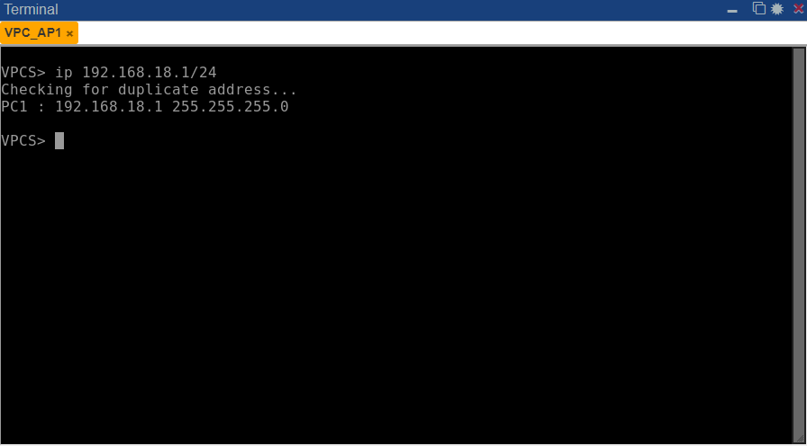

# Práctica 1

| Carnet | Nombre|
| ------ | ----- |
| [`201900042`](https://github.com/rodrialeh01) | Rodrigo Alejandro Hernández de León |
| [`201901772`](https://github.com/DanielDubonDR) | Daniel Reginaldo Dubón Rodríguez |

# Manual Técnico

## 1. Topología de red


<div align="center"></div>

## 2. Tabla de resumen de las direcciones IP


Para la segmentación de redes en las VPC (Virtual Private Cloud), se optó por asignar direcciones IP que incorporan un identificador único. En nuestro contexto particular, se seleccionó el identificador 18, lo que resultó en el establecimiento de la serie de direcciones de red 192.168.18. Para la subdivisión en hosts, se aplicaron rangos específicos en cada nivel de la arquitectura.

- ### Nivel 1

Dentro del nivel 1 de la infraestructura, se procedió a asignar el rango de direcciones IP correspondiente al conjunto de hosts, abarcando desde el identificador 1 hasta el 4. Estos hosts fueron conectados de manera centralizada al `SW1`.

|Nivel| Área | Nombre del dispositivo | Dirección IP | Máscara de subred |
|-----| ---- | ---------------------- | ------------ | ----------------- |
|1| Almacenamiento de Paquetes | VPC_AP1 | 192.168.18.1 | 255.255.255.0 |
|1| Almacenamiento de Paquetes | VPC_AP2 | 192.168.18.2 | 255.255.255.0 |
|1| Recepción | VPC_R1 | 192.168.18.3 | 255.255.255.0 |
|1| Recepción | VPC_R2 | 192.168.18.4 | 255.255.255.0 |

- ### Nivel 2
Dentro del nivel 2 de la infraestructura, se procedió a asignar el rango de direcciones IP correspondiente al conjunto de hosts, abarcando desde el identificador 5 hasta el 11. Estos hosts fueron conectados de manera centralizada al `SW2`.

|Nivel| Área | Nombre del dispositivo | Dirección IP | Máscara de subred |
|-----| ---- | ---------------------- | ------------ | ----------------- |
|2| Oficina Administrativa | VPC_A1 | 192.168.18.5 | 255.255.255.0 |
|2| Oficina Administrativa | VPC_A2 | 192.168.18.6 | 255.255.255.0 |
|2| Oficina Administrativa | VPC_A3 | 192.168.18.7 | 255.255.255.0 |
|2| Atención al Cliente | VPR_AC1 | 192.168.18.8 | 255.255.255.0 |
|2| Atención al Cliente | VPR_AC2 | 192.168.18.9 | 255.255.255.0 |
|2| Atención al Cliente | VPR_AC3 | 192.168.18.10 | 255.255.255.0 |
|2| Atención al Cliente | VPR_AC4 | 192.168.18.11 | 255.255.255.0 |

- ### Nivel 3

Dentro del nivel 3 de la infraestructura, se procedió a asignar el rango de direcciones IP correspondiente al conjunto de hosts, abarcando desde el identificador 12 hasta el 16. Estos hosts fueron conectados de manera centralizada al `SW3`.

|Nivel| Área | Nombre del dispositivo | Dirección IP | Máscara de subred |
|-----| ---- | ---------------------- | ------------ | ----------------- |
|3| Operaciones | VPC_O1 | 192.168.18.12 | 255.255.255.0 |
|3| Operaciones | VPC_O2 | 192.168.18.13 | 255.255.255.0 |
|3| Operaciones | VPC_O3 | 192.168.18.14 | 255.255.255.0 |
|3| Gerencia | VPC_G1 | 192.168.18.15 | 255.255.255.0 |
|3| Gerencia | VPC_G2 | 192.168.18.16 | 255.255.255.0 |

## 3. Listado de Hardware

| Cantidad | Nombre | Marca | Modelo | Imagen |
| -------- | ------ | ----- | ------ | ------ |
| 2 | Switch de 8 Puertos | TP-LINK | TL-SG108 V6 | <div align="center"></div> |
| 1 | Switch de 16 Puertos | TP-LINK |  TL-SG1016 (V13) | <div align="center"></div> |
| 180(m) | Cable UTP CAT5E CCA | CMPLE | AZ-305AL | <div align="center"></div>  |
| 36 | Conector RJ45 | Intellinet | 790055 |  |
| 16 | Monitor | AOC | 20E1H | <div align="center"></div> |
| 16 | PC |DELL|OPTIPLEX 3000 MFF i3 12100T 2.2GHZ 8GB 1TB W10P|<div align="center"></div>|
| 16 | Teclado | XTECH | XTK-092S | <div align="center"></div> |
| 16 | Mouse  |XTECH | XTM-195 |  <div align="center"></div> |
| 3 | UPS DE 8 SALIDAS (400W)| CENTRA PLUS | INTERACT | <div align="center"></div> |


## 4. Configuración de las VPCs

Para la configuración de las VPCs, se procedió a establecer las direcciones IP correspondientes a cada una de las VPCs, de acuerdo a la tabla de resumen de direcciones IP. Para ello, se utilizó el comando:
```bash
ip <dirección IP>/24
```
Donde se muestra las configuracióndes de 1 VPC por cada nivel:

- ### Nivel 1

Configurando la VPC `VPC_AP1`:
```bash
VPCS> ip 192.168.18.1/24
```


y posteriormente se visualiza la ip de la VPC:

```bash
VPCS> show
```


y por ultimo se guarda las configuraciones de la VPC:

```bash
VPCS> save
```


- ### Nivel 2

Configurando la VPC `VPC_A1`:
```bash
VPCS> ip 192.168.18.5/24
```


y posteriormente se visualiza la ip de la VPC:

```bash
VPCS> show
```


y por ultimo se guarda las configuraciones de la VPC:

```bash
VPCS> save
```


- ### Nivel 3

Configurando la VPC `VPC_G1`:
```bash
VPCS> ip 192.168.18.15/24
```


y posteriormente se visualiza la ip de la VPC:

```bash
VPCS> show
```


y por ultimo se guarda las configuraciones de la VPC:

```bash
VPCS> save
```


## 5. Capturas pcapng

- ### Nivel 1
    Se realizo la captura de la VPC `VPC_AP1` y `VPC_R1` donde se encuentra en el archivo [L1-AP1-R1](./Capturas/L1-AP1-R1.pcapng).

- ### Nivel 2
    Se realizo la captura de la VPC `VPC_AC3` y `VPC_A3` donde se encuentra en el archivo [L2-AC3-A3](./Capturas/L2-AC3-A3.pcapng).

- ### Nivel 3
    Se realizo la captura de la VPC `VPC_O3` y `VPC_G1` donde se encuentra en el archivo [L3-O3-G1](./Capturas/L3-O3-G1.pcapng).
