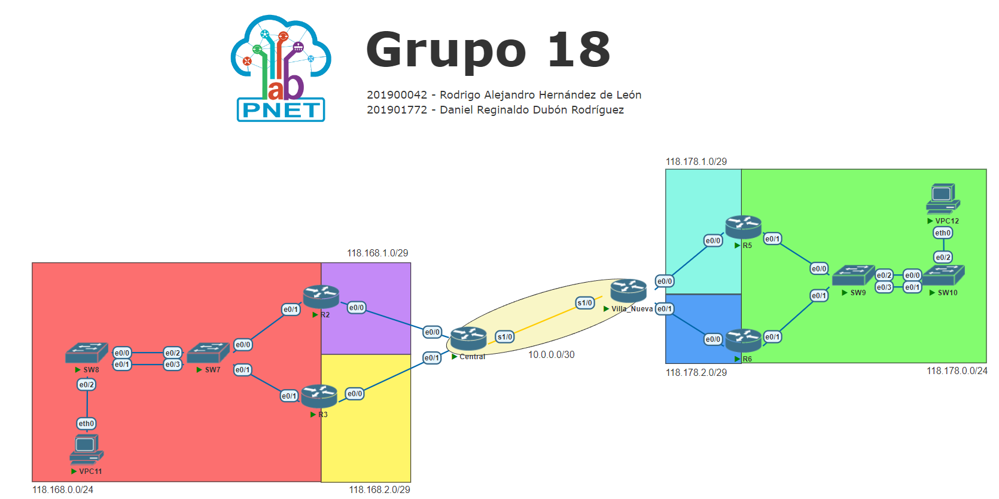

# Práctica 2

| Carnet | Nombre|
| ------ | ----- |
| [`201900042`](https://github.com/rodrialeh01) | Rodrigo Alejandro Hernández de León |
| [`201901772`](https://github.com/DanielDubonDR) | Daniel Reginaldo Dubón Rodríguez |

# Manual Técnico

## 1. Topología de red

<div align="center"></div>

## 2. Tabla de direcciones IP utilizadas

| Dispositivo | Dirección IP | Interfaz | Máscara de subred |
| --------- | ------------ | -------- | ----------------- |
| VPC11 | 118.168.0.4| eth0 | 255.255.255.0 |
| R2 | 118.168.1.1 | e0/0 | 255.255.255.248 |
| R2 | 118.168.0.2 | e0/1 | 255.255.255.0 |
| R3 | 118.168.2.1 | e0/0 | 255.255.255.248 |
| R3 | 118.168.0.3 | e0/1 | 255.255.255.0 |
| R2 - R3 | 118.168.0.1 | Virtual | 255.255.255.0 |
| Central | 10.0.0.1 | s1/0 | 255.255.255.252 |
| Central | 118.168.1.2 | e0/0 | 255.255.255.248 |
| Central | 118.168.2.2 | e0/1 | 255.255.255.248 |
| Villa Nueva | 10.0.0.2 | s1/0 | 255.255.255.252 |
| Villa Nueva | 118.178.1.1 | e0/0 | 255.255.255.248 |
| Villa Nueva | 118.178.2.1 | e0/1 | 255.255.255.248 |
| R5 | 118.178.1.2 | e0/0 | 255.255.255.248 |
| R5 | 118.178.0.2 | e0/1 | 255.255.255.0 |
| R6 | 118.178.2.2 | e0/0 | 255.255.255.248 |
| R6 | 118.178.0.3 | e0/1 | 255.255.255.0 |
| R5 - R6 | 118.178.0.1 | Virtual | 255.255.255.0 |
| VPC12 | 118.178.0.4 | eth0 | 255.255.255.0 |

## 3. Tabla de rangos de IPs disponibles en cada subred

| ID red       | Mascara de subred | Cantidad de IPs disponibles | Primera IP disponible | Ultima IP disponible | Dirección de broadcast |
| ------------ | ----------------- | --------------------------- | --------------------- | -------------------- | ---------------------- |
| 118.168.0.0  | 255.255.255.0     | 254                         | 118.168.0.1           | 118.168.0.254        | 118.168.0.255          |
| 118.168.1.0  | 255.255.255.248   | 6                           | 118.168.1.1           | 118.168.1.6          | 118.168.1.7            |
| 118.168.2.0  | 255.255.255.248   | 6                           | 118.168.2.1           | 118.168.2.6          | 118.168.2.7            |
| 10.0.0.0     | 255.255.255.252   | 2                           | 10.0.0.1              | 10.0.0.2             | 10.0.0.3               |
| 118.178.0.0  | 255.255.255.0     | 254                         | 118.178.0.1           | 118.178.0.254        | 118.178.0.255          |
| 118.178.1.0  | 255.255.255.248   | 6                           | 118.178.1.1           | 118.178.1.6          | 118.178.1.7            |
| 118.178.2.0  | 255.255.255.248   | 6                           | 118.178.2.1           | 118.178.2.6          | 118.178.2.7            |


## 4. Configuración de Routers

### 4.1 Configuración router Central

El archivo del script de configuración del router Central lo puede encontrar en el siguiente [enlace](./Scripts/ScriptCentral.txt).

```cisco
enable
configure terminal
hostname CENTRAL
interface s1/0
ip address 10.0.0.1 255.255.255.252
no shutdown
exit

interface e0/0
ip address 118.168.1.2 255.255.255.248
no shutdown
exit

interface e0/1
ip address 118.168.2.2 255.255.255.248
no shutdown
exit


! ----------- R2
! Hacia 118.168.1.0/29
ip route 118.168.1.0 255.255.255.248 118.168.1.1

! Hacia 118.168.0.0/24
ip route 118.168.0.0 255.255.255.0 118.168.1.1

! ----------- R3
! Hacia 118.168.2.0/29
ip route 118.168.2.0 255.255.255.248 118.168.2.1

! Hacia 118.168.0.0/24
ip route 118.168.0.0 255.255.255.0 118.168.2.1

! --------------------------------
! ----------- Villa Nueva
! Hacia 10.0.0.0/30
ip route 10.0.0.0 255.255.255.252 10.0.0.2

! ----------- R5
! Hacia 118.178.1.0/29
ip route 118.178.1.0 255.255.255.248 10.0.0.2

! Hacia 118.178.0.0/24
ip route 118.178.0.0 255.255.255.0 10.0.0.2

! ----------- R6
! Hacia 118.178.2.0/29
ip route 118.178.2.0 255.255.255.248 10.0.0.2

exit
copy running-config startup-config


```

### 4.2 Configuración router R2

El archivo del script de configuración del router R2 lo puede encontrar en el siguiente [enlace](./Scripts/ScriptR2.txt).

```cisco
enable
configure terminal
hostname R2
interface e0/1
ip address 118.168.0.2 255.255.255.0
no shutdown

glbp 1 ip 118.168.0.1
glbp 1 preempt
glbp 1 priority 150
glbp 1 load-balancing round-robin

interface e0/0
ip address 118.168.1.1 255.255.255.248
no shutdown
exit


! -----------
! Hacia 118.168.1.0/29
ip route 118.168.1.0 255.255.255.248 118.168.1.2

! Hacia 118.168.2.0/29
ip route 118.168.2.0 255.255.255.248 118.168.2.2

! Hacia 10.0.0.0/30
ip route 10.0.0.0 255.255.255.252 118.168.1.2

! Hacia 118.178.1.0/29
ip route 118.178.1.0 255.255.255.248 118.168.1.2

! Hacia 118.178.2.0/29
ip route 118.178.2.0 255.255.255.248 118.168.1.2

! Hacia 118.178.0.0/24
ip route 118.178.0.0 255.255.255.0 118.168.1.2

exit
copy running-config startup-config

```	

### 4.3 Configuración router R5

El archivo del script de configuración del router R5 lo puede encontrar en el siguiente [enlace](./Scripts/ScriptR5.txt).

```cisco
enable
configure terminal
hostname R5
interface e0/1
ip address 118.178.0.2 255.255.255.0
no shutdown

standby version 2
standby 1 ip 118.178.0.1
standby 1 priority 109
standby 1 preempt

interface e0/0
ip address 118.178.1.2 255.255.255.248
no shutdown
exit


!-----------
! Hacia 118.178.1.0/29
ip route 118.178.1.0 255.255.255.248 118.178.1.1

! Hacia 10.0.0.0/30
ip route 10.0.0.0 255.255.255.252 118.178.1.1

! Hacia 118.168.1.0/29
ip route 118.168.1.0 255.255.255.248 118.178.1.1

! Hacia 118.168.2.0/29
ip route 118.168.2.0 255.255.255.248 118.178.1.1

! Hacia 118.168.0.0/24
ip route 118.168.0.0 255.255.255.0 118.178.1.1

exit
copy running-config startup-config

```

### 4.4 Configuración switch SW7

El archivo del script de configuración del switch SW7 lo puede encontrar en el siguiente [enlace](./Scripts/ScriptSW7.txt).

```cisco
enable
configure terminal
hostname SW7
interface range e0/2-3
channel-group 1 mode active
no shutdown
exit
exit
copy running-config startup-config

```

### 4.5 Configuración VPC11

El archivo del script de configuración de la VPC11 lo puede encontrar en el siguiente [enlace](./Scripts/ScriptVPC11.txt).

```cisco
ip 118.168.0.4/24 118.168.0.1
save
```

## 5. Configuración de Switches

## 6. Resumen de comandos usados

## 7. Comandos para la verificación del correcto funcionamiento de los protocolos empleados
