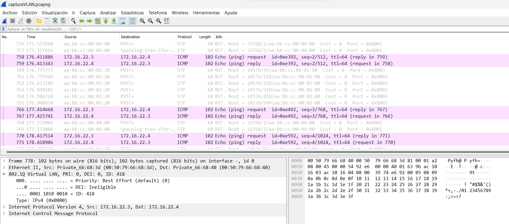

# Proyecto 1

| Carnet | Nombre|
| ------ | ----- |
| [`201900042`](https://github.com/rodrialeh01) | Rodrigo Alejandro Hernández de León |
| [`201901772`](https://github.com/DanielDubonDR) | Daniel Reginaldo Dubón Rodríguez |

# Manual Técnico

## 1. Topología de red

<div align="center"></div>

## 2. Tabla de resumen de las direcciones IP

| Dispositivo | Dirección IP | Id de red | Máscara de subred | Gateway | VLAN |
| ----------- | ------------ | --------- | ----------------- | ------- | ---- |
| **`ADMINISTRACION`** | **`172.16.19.2`** | **`172.16.19.0`** | **`255.255.255.0`** | **`172.16.19.1`** | **`118`** |
| ADM1 | 172.16.19.3 | 172.16.19.0 | 255.255.255.0 | 172.16.19.1 | 118 |
| ADM2 | 172.16.19.4 | 172.16.19.0 | 255.255.255.0 | 172.16.19.1 | 118 |
| **`ACADEMICO`** | **`172.16.20.2`** | `172.16.20.0` | **`255.255.255.0`** | **`172.16.20.1`** | **`218`** |
| ACA1 | 172.16.20.3 | 172.16.20.0 | 255.255.255.0 | 172.16.20.1 | 218 |
| ACA2 | 172.16.20.4 | 172.16.20.0 | 255.255.255.0 | 172.16.20.1 | 218 |
| **`INVESTIGACION`** | **`172.16.21.2`** | **`172.16.21.0`**| **`255.255.255.0`** | **`172.16.21.1`** | **`318`** |
| INV1 | 172.16.21.3 | 172.16.21.0 | 255.255.255.0 | 172.16.21.1 | 318 |
| INV2 | 172.16.21.4 | 172.16.21.0 | 255.255.255.0 | 172.16.21.1 | 318 |
| **`SEGURIDAD`** | **`172.16.22.2`** | **`172.16.22.0`** | **`255.255.255.0`** | **`172.16.22.1`** | **`418`** |
| SEG1 | 172.16.22.3 | 172.16.22.0 | 255.255.255.0 | 172.16.22.1 | 418 |
| SEG2 | 172.16.22.4 | 172.16.22.0 | 255.255.255.0 | 172.16.22.1 | 418 |

## 3. Scripts de configuración

Los scripts de configuración de cada switch se pueden encontrar en la carpeta [`Scripts`](./Scripts/), además se mostrarán los scripts más importantes a continuación:

1. Switch `ESW1`:

```
! Configuración del ESW1 por parte del grupo 18
! Entrar a modo configuración
enable
configure terminal

! Colocarle nombre al host
hostname ESW1

! Creando y definiendo las vlans
! Creando vlan 118 - Administracion
vlan 118
name Administracion
! Creando vlan 218 - Control Academico
vlan 218
name Control Academico
! Creando vlan 318 - Centro de Investigaciones
vlan 318
name Centro de Investigaciones
! Creando vlan 418 - Seguridad
vlan 418
name Seguridad
! Creando vlan 99 - Nativa
vlan 99
name Nativa
! Creando vlan 999 - Blackhole
vlan 999
name Blackhole
! Termina de crear las vlans y sale de su configuración
exit

! Configurando el vtp v2 en modo servidor
vtp version 2
vtp mode server
! Se agrega el dominio y la contraseña del vtp
vtp domain pareja18
vtp password usac

! Configurando el modo troncal e0/0-3
interface range Ethernet 0/0-3
switchport trunk encapsulation dot1q
switchport mode trunk

! Cambiando los puertos troncales que contienen la VLAN nativa de la que viene predeterminada en el switch a la vlan 99
switchport trunk native vlan 99

! Restringiendo las vlan que se pasarán en modo troncal
switchport trunk allowed vlan 118,218,318,418,99,999,1002-1005

! Configurando el modo troncal e1/0-2
interface range Ethernet 1/0-2
switchport trunk encapsulation dot1q
switchport mode trunk

! Cambiando los puertos troncales que contienen la VLAN nativa de la que viene predeterminada en el switch a la vlan 99
switchport trunk native vlan 99

! Restringiendo las vlan que se pasarán en modo troncal
switchport trunk allowed vlan 118,218,318,418,99,999,1002-1005

! Asignando todos los puertos sin usar en los switches a la VLAN (999) de Blackhole e1/3
interface ethernet 1/3
switchport mode access
switchport access vlan 999

! Se configura el protocolo STP en modo rapid-pvst
spanning-tree mode rapid-pvst
! Se define el "root" y se le indica las vlans con las cual trabajará
spanning-tree vlan 118,218,318,418,99,999 root primary

! Guardando las configuraciones
do write
```

2. Switch `SW5`:

```
! Configuración del SW5 por parte del grupo 18
! Entrar a modo configuración
enable
configure terminal

! Colocarle nombre al host
hostname SW5

! Configurando el vtp v2 en modo servidor
vtp version 2
vtp mode client
! Se agrega el dominio y la contraseña del vtp
vtp domain pareja18
vtp password usac

! Configurando el modo troncal e0/0-1
interface range Ethernet 0/0-1
switchport trunk encapsulation dot1q
switchport mode trunk

! Cambiando los puertos troncales que contienen la VLAN nativa de la que viene predeterminada en el switch a la vlan 99
switchport trunk native vlan 99

! Configurando el modo cliente SEG2 asignandole la vlan 418
interface ethernet 0/2
switchport mode access
switchport access vlan 418

! Configurando el modo cliente ACA1 asignandole la vlan 218
interface ethernet 0/3
switchport mode access
switchport access vlan 218

exit

! Se configura el protocolo STP en modo rapid-pvst
spanning-tree mode rapid-pvst

! Guardando las configuraciones
do write
```

3. Switch `SW`:

```
! Configuración del SW por parte del grupo 18
! Entrar a modo configuración
enable
configure terminal

! Colocarle nombre al host
hostname SW

! Configurando el vtp v2 en modo servidor
vtp version 2
vtp mode client
! Se agrega el dominio y la contraseña del vtp
vtp domain pareja18
vtp password usac

! Configurando el modo troncal e0/0-1
interface range Ethernet 0/0-1
switchport trunk encapsulation dot1q
switchport mode trunk

! Cambiando los puertos troncales que contienen la VLAN nativa de la que viene predeterminada en el switch a la vlan 99
switchport trunk native vlan 99
exit

! Configurando el modo cliente pc1 asignandole la vlan 118
interface ethernet 0/2
switchport mode access
switchport access vlan 118

! Configurando el modo cliente pc2 asignandole la vlan 418
interface ethernet 0/3
switchport mode access
switchport access vlan 418

! Configurando el modo cliente pc3 asignandole la vlan 218
interface ethernet 1/0
switchport mode access
switchport access vlan 218

! Configurando el modo cliente pc3 asignandole la vlan 318
interface ethernet 1/1
switchport mode access
switchport access vlan 318

exit

! Asignando todos los puertos sin usar en los switches a la VLAN (999) de Blackhole e1/2-3
interface range Ethernet 1/2-3
switchport mode access
switchport access vlan 999
exit

! Se configura el protocolo STP en modo rapid-pvst
spanning-tree mode rapid-pvst

! Guardando las configuraciones
do write
```

## 4. Capturas de Whireshark



La captura pcapng donde se mustra el id de la VLAN lo puede encontrar en la siguiente carpeta de [`Captura`](./Captura/capturaVLAN.pcapng).

## 5. Presupuesto para la realización del proyecto

Este lo puede encontrar en el siguiente enlace de [`Presupuesto`](./Presupuesto/).

## 6. Resultado del proyecto

Se puede visualizar el archivo de pnetlab en el siguiente enlace de [`Topología`](./Topología/).