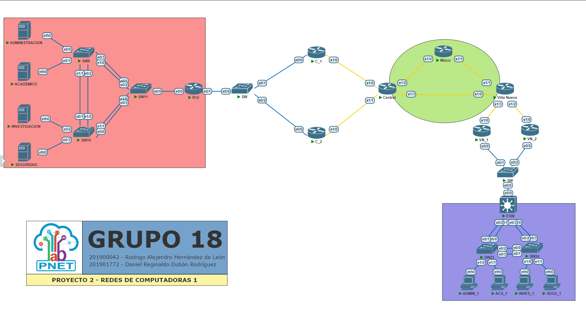
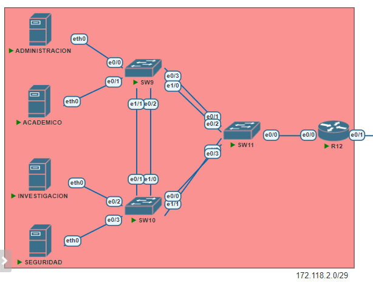
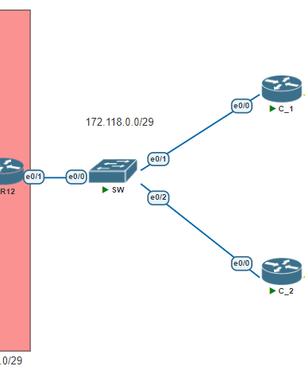
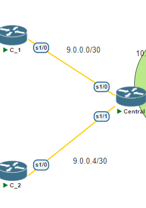
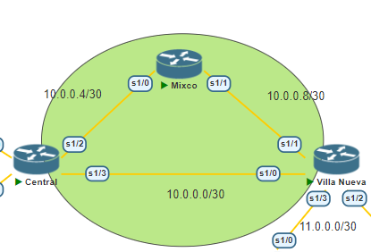
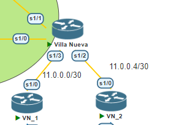
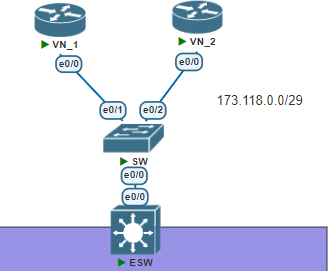
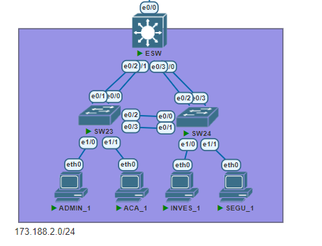

# Proyecto 2

| Carnet | Nombre|
| ------ | ----- |
| [`201900042`](https://github.com/rodrialeh01) | Rodrigo Alejandro Hernández de León |
| [`201901772`](https://github.com/DanielDubonDR) | Daniel Reginaldo Dubón Rodríguez |

# Manual Técnico

## 1. Topología de red



## 2. Tabla de rangos de IPs utilizadas

### Central

| Dispositivo | Dirección IP | Interfaz | Puerta de enlace | Máscara de subred |
| ----------- | ------------ | -------- | ---------------- | ----------------- |
| ACADEMICO | 172.118.2.2 | eth0 | 172.118.2.1 | 255.255.255.224 |
| INVESTIGACION | 172.118.2.34 | eth0 | 172.118.2.33 | 255.255.255.240 |
| ADMINISTRACION | 172.118.2.50 | eth0 | 172.118.2.49 | 255.255.255.240 |
| SEGURIDAD | 172.118.2.66 | eth0 | 172.118.2.65 | 255.255.255.248 |
| R | 172.118.0.4 | e0/1 |  | 255.255.255.248 |
| C_1 | 172.118.0.2 | e0/0 |  | 255.255.255.248 |
| C_1 | 9.0.0.1 | s1/0 |  | 255.255.255.252 |
| C_2 | 172.118.0.3 | e0/0 |  | 255.255.255.248 |
| C_2 | 9.0.0.5 | s1/0 |  | 255.255.255.252 |
| VIRTUAL | 172.118.0.1 | |  | 255.255.255.248 |
| CENTRAL | 172.118.0.2 | s1/0 |  | 255.255.255.252 |
| CENTRAL | 172.118.0.6 | s1/1 |  | 255.255.255.252 |
| CENTRAL | 10.0.0.5 | s1/2 |  | 255.255.255.252 |
| CENTRAL | 10.0.0.1 | s1/3 |  | 255.255.255.252 |

#### Vlans
| VLAN| ID VLAN | Dirección IP | Máscara de subred |
| ----| ---- | ------------ | ----------------- |
| ACADEMICO | 118 | 173.118.2.1 | 255.255.255.224 |
| INVESTIGACION | 218 | 173.118.2.33 | 255.255.255.240 |
| ADMINISTRACION | 318 | 173.118.2.6 | 255.255.255.240 |
| SEGURIDAD | 418 | 173.118.2.65 | 255.255.255.248 |


### Villa Nueva

| Dispositivo | Dirección IP | Interfaz | Puerta de enlace | Máscara de subred |
| ----------- | ------------ | -------- | ---------------- | ----------------- |
| ADMIN_1 | 173.118.2.66 | eth0 | 173.118.2.65 | 255.255.255.248 |
| ACA_1 | 173.118.2.2 | eth0 | 173.118.2.1 | 255.255.255.224 |
| INVES_1 | 173.118.2.50 | eth0 | 173.118.2.49 | 255.255.255.240 |
| SEGU_1 | 173.118.2.34 | eth0 | 173.118.2.33 | 255.255.255.255.240 |
| ESW | 173.118.0.4 | e0/0 |  | 255.255.255.248 |
| VN_1 | 173.118.0.2 | e0/0 |  | 255.255.255.248 |
| VN_1 | 11.0.0.1 | s1/0 |  | 255.255.255.252 |
| VN_2 | 173.118.0.3 | e0/0 |  | 255.255.255.248 |
| VN_2 | 11.0.0.5 | s1/0 |  | 255.255.255.252 | 
| VN_1 VN_2 | 173.118.0.1 | Virtual | | 255.255.255.248 |
| Villa Nueva | 11.0.0.2 | s1/3 |  | 255.255.255.252 |
| Villa Nueva | 11.0.0.6 | s1/2 |  | 255.255.255.252 |
| Villa Nueva | 10.0.0.2 | s1/0 |  | 255.255.255.252 |
| Villa Nueva | 10.0.0.10 | s1/1 |  | 255.255.255.252 |

#### Vlans
| Vlan | Dirección IP | Máscara de subred |
| ---- | ------------ | ----------------- |
| 118 | 173.118.2.65 | 255.255.255.248 |
| 218 | 173.118.2.33 | 255.255.255.240 |
| 318 | 173.118.2.1 | 255.255.255.224 |
| 518 | 173.118.2.49 | 255.255.255.240 |

### Core
| Dispositivo | Dirección IP | Interfaz | Puerta de enlace | Máscara de subred |
| ----------- | ------------ | -------- | ---------------- | ----------------- |
| Mixco | 10.0.0.6 | s1/0 |  | 255.255.255.252 |
| Mixco | 10.0.0.9 | s1/1 |  | 255.255.255.252 |

## 3. Redes utilizadas

| ID de red | Mascara de subred | Cantidad de IPs Disponibles | Primera IP disponible | Última IP disponible | Broadcast | Puerta de enlace |
| --------- | ----------------- | --------------------------- | --------------------- | -------------------- | --------- | --------------- |
| 173.118.2.0 | 255.255.255.254 | 30 | 173.118.2.1 | 173.118.2.30 | 173.118.2.31 | 173.118.2.1 |
| 173.118.2.33 | 255.255.255.240 | 14 | 173.118.2.33 | 173.118.2.46 | 173.118.2.47 | 173.118.2.33 |
| 173.118.2.48 | 255.255.255.240 | 14 | 173.118.2.49 | 173.118.2.62 | 173.118.2.63 | 173.118.2.49 |
| 173.118.2.63 | 255.255.255.248 | 6 | 173.118.2.65 | 173.118.2.70 | 173.118.2.71 | 173.118.2.65 |
| 173.118.0.0 | 255.255.255.248 | 6 | 173.118.0.1 | 173.118.0.6 | 173.118.0.7 | 173.118.0.1 |
| 172.118.2.0 | 255.255.255.224 | 30 | 172.118.2.1 | 172.118.2.30 | 173.118.2.31 | 173.118.2.1 |
| 172.118.2.32 | 255.255.255.240 | 14 | 172.118.2.33 | 172.118.2.46 | 173.118.2.47 | 173.118.2.33 |
| 172.118.2.48 | 255.255.255.240 | 14 | 172.118.2.49 | 172.118.2.62 | 173.118.2.63 | 173.118.2.49 |
| 172.118.2.64 | 255.255.255.248 | 6 | 172.118.2.65 | 172.118.2.70 | 173.118.2.71 | 173.118.2.65 |
| 11.0.0.0 | 255.255.255.252 | 2 | 11.0.0.1 | 11.0.0.2 | 11.0.0.3 |  |
| 11.0.0.4 | 255.255.255.252 | 2 | 11.0.0.5 | 11.0.0.6 | 11.0.0.7 |  |
| 10.0.0.0 | 255.255.255.252 | 2 | 10.0.0.1 | 10.0.0.2 | 10.0.0.3 |  |
| 10.0.0.4 | 255.255.255.252 | 2 | 10.0.0.5 | 10.0.0.6 | 10.0.0.7 |  |
| 10.0.0.8 | 255.255.255.252 | 2 | 10.0.0.9 | 10.0.0.10 | 10.0.0.11 |  |
| 9.0.0.0 | 255.255.255.252 | 2 | 11.0.0.1 | 9.0.0.2 | 9.0.0.3 |  |
| 9.0.0.4 | 255.255.255.252 | 2 | 11.0.0.5 | 9.0.0.6 | 9.0.0.7 |  |

## 4. Procedimientos realizados

### 4.1. VLSM de Central

1. Obtenemos el id de la red.

```
En la central el id de la red es 172.118.2.0/25
```

2. Obtenemos la cantidad de hosts por cada subred.

| Subred | Cantidad de hosts | ID de Vlan |
| ------ | ----------------- | ---------- |
| Administracion | 9 | 318 |
| Academico | 21 | 118 |
| Investigacion | 12 | 218 |
| Seguridad | 4 | 418 |

3. Reordenamos las subredes de mayor a menor de acuerdo a la cantidad de hosts.

| Subred | Cantidad de hosts | ID de Vlan |
| ------ | ----------------- | ---------- |
| Academico | 21 | 118 |
| Investigacion | 12 | 218 |
| Administracion | 9 | 318 |
| Seguridad | 4 | 418 |

4. Obtenemos la mascara de subred que pueda contener la cantidad de hosts.

| Subred | Cantidad de hosts | CDIR | Mascara de subred |
| ------ | ----------------- | ---- |----------------- |
| Academico | 21 | /27 | 255.255.255.224 |
| Investigacion | 12 | /28 | 255.255.255.240 |
| Administracion | 9 | /28 | 255.255.255.240 |
| Seguridad | 4 | /30 | 255.255.255.248 |

5. Calculamos las ips, los id de cada subred y su broadcast.

 - Primera IP disponible = ID de red + 1
 - Última IP disponible = Broadcast - 1
 - Broadcast = ID de red + 2^n - 1, donde n es la cantidad de bits prestados.
 - Cantidad de IPs Disponibles = 2^n - 2, donde n es la cantidad de bits prestados.
 - Puerta de enlace = Primera IP disponible
 - Siguiente subred = Broadcast + 1

| Subred | Cantidad de hosts | CDIR | Mascara de subred | Cantidad de IPs Disponibles | ID de red | Primera IP disponible | Última IP disponible | Broadcast | Puerta de enlace |
| ------ | ----------------- | ---- |----------------- | --------------------------- | --------------------- | -------------------- | --------- | --------------- | --- |
| Academico | 21 | /27 | 255.255.255.224 | 30 | 172.118.2.0 | 172.118.2.1 | 172.118.2.30 | 172.118.2.31 | 172.118.2.1 |
| Investigacion | 12 | /28 | 255.255.255.240 | 14 | 172.118.2.32 | 172.118.2.33 | 172.118.2.46 | 172.118.2.47 | 172.118.2.33 |
| Administracion | 9 | /28 | 255.255.255.240 | 14 | 172.118.2.48 | 172.118.2.49 | 172.118.2.62 | 172.118.2.63 | 172.118.2.49 |
| Seguridad | 4 | /30 | 255.255.255.248 | 6 | 172.118.2.64 | 172.118.2.65 | 172.118.2.70 | 172.118.2.71 | 172.118.2.65 |


### 4.2. FLSM de Core

1. Obtenemos el id de la red.

```
En el core el id de la red es 10.0.0.0/28
```

2. Obtenemos la cantidad de hosts por cada subred.

| Subred | Cantidad de hosts |
| ------ | ----------------- |
| Central - Villa Nueva | 2 |
| Central - Mixco | 2 |
| Mixco - Villa Nueva | 2 |

3. Obtenemos la mascara de subred que pueda contener la cantidad de hosts.

| Subred | Cantidad de hosts | Mascara de subred |
| ------ | ----------------- | ----------------- |
| Central - Villa Nueva | 2 | 255.255.255.252 |
| Central - Mixco | 2 | 255.255.255.252 |
| Mixco - Villa Nueva | 2 | 255.255.255.252 |

4. Calculamos las ips, los id de cada subred y su broadcast.

 - Primera IP disponible = ID de red + 1
 - Última IP disponible = Broadcast - 1
 - Broadcast = ID de red + 2^n - 1, donde n es la cantidad de bits prestados.
 - Cantidad de IPs Disponibles = 2^n - 2, donde n es la cantidad de bits prestados.
 - Siguiente subred = Broadcast + 1

| ID de red | Mascara de subred | Cantidad de IPs Disponibles | Primera IP disponible | Última IP disponible | Broadcast |
| --------- | ----------------- | --------------------------- | --------------------- | -------------------- | --------- |
| 10.0.0.0 | 255.255.255.252 | 2 | 10.0.0.1 | 10.0.0.2 | 10.0.0.3 |
| 10.0.0.4 | 255.255.255.252 | 2 | 10.0.0.5 | 10.0.0.6 | 10.0.0.7 |
| 10.0.0.8 | 255.255.255.252 | 2 | 10.0.0.9 | 10.0.0.10 | 10.0.0.11 |

## 5. Implementación de la topología

## Central:

### Red 1:


### Red 2:


### Red 3:


## Core:


## Villa Nueva:

### Red 3:


### Red 2:



### Red 1:



## 6. Configuración de dispositivos

Cualquier configuración de dispositivos se encuentra en la carpeta [Scripts](./Scripts/)